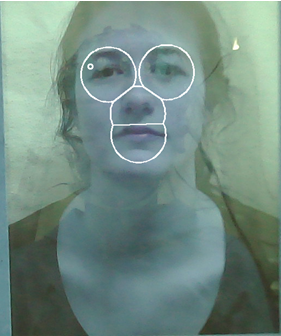

## Project Description
This solution offers an automated mapping pipeline that enables the processing of wearable eye tracking data in the context of dynamic face-to-face social interactions. Presently, the solution is tailored to data captured using Open Source PupilLabs eye trackers.

The pipeline has the capacity to automatically recognize, label, and track the position of specific facial features of interest such as the left and right eye, nose, and mouth. Currently, facial areas of interest (AOIs) are defined using the Limited-Radius Voronoi-Tessellation (LRVT) method (see figure below). Furthermore, it can automatically determine and annotate the corresponding AOIs for each recorded fixation, providing valuable insights into the participant's viewing patterns in terms of when and where they focus their gaze.

The face mapping algorithm leverages [PIPNet](https://github.com/jhb86253817/PIPNet) technology.

## Usage
* Clone this repository
* Install Docker
* Pull the Docker image using `docker pull ghcr.io/jelleve/eye-tracking:latest`
* Run a new Docker container using `docker run -d -p 5000:5000 ghcr.io/jelleve/eye-tracking:latest`
* Open the `launcher.html` file from this repository, select the relevant files and push the process button

## Notes
* Currently used: https://github.com/1adrianb/face-alignment (uses dlib)
* 3fabrec: https://github.com/browatbn2/3FabRec
* LFFD: https://github.com/YonghaoHe/LFFD-A-Light-and-Fast-Face-Detector-for-Edge-Devices (no alignment?)
* PyLandmark: https://github.com/cnzeki/PyLandmark (no reference)
* TO INVESTIGATE: Retinaface

* TO CHECK 05/07: https://github.com/cunjian/pytorch_face_landmark
* TODO: check KPNet paper
* TODO: PIPNET -> Tested, fast
